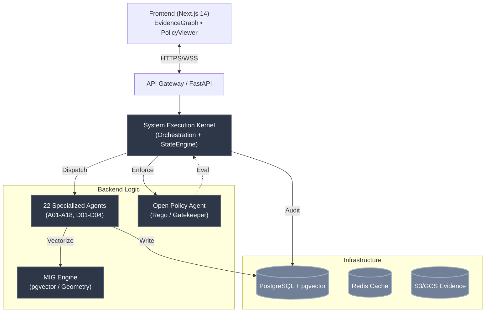

# Fellow Governance 🛡️🤖
> SaaS Platform for AI Governance, Geometric Interpretability, and Adversarial Defense  
> *Translating technical requirements into auditable legal evidence and executable policies*

[](LICENSE)
[](https://python.org)
[](https://fastapi.tiangolo.com)
[](https://nextjs.org)
[](https://openpolicyagent.org)

---

## 🎯 Mission
Empower **AI governance leaders** and **legal professionals** to respond to AI framework violation notices (NIST AI RMF, EU AI Act, PL 2338/2023, LGPD), transforming complex technical requirements into:
- ✅ Auditable legal evidence
- ✅ Executable Rego policies via OPA
- ✅ Immutable audit trails (SHA-256 hash chain)
- ✅ Adversarial defense generation in ≤300 seconds

### 👥 Target Audience
| Profile | Primary Use Case |
|---------|------------------|
| ⚖️ Lawyer | Defense Mode: upload notice → 3-line thesis + forensic ZIP |
| 🛡️ AI Governance Lead | Risk dashboard, OPA blocking, MSB-21 tracking |
| 📋 Auditor | Immutable trails, forensic reports, evidence ↔ controls |
| 💻 Security/DevOps | Rego deployment, drift monitoring, CI/CD integration |

---

## ⚡ The Problem We Solve
| ❌ Without Fellow Governance | ✅ With Fellow Governance |
|------------------------------|---------------------------|
| Speed over compliance → Missing AIBOM/provenance → Regulatory fines | OPA blocks non-compliant deployments → Enforcement **before** violations |
| Black-box AI decisions → Unauditable risk | MIG relevance vectors prove decision drivers mathematically |
| Reactive defense after notices | Forensic ZIP + regressive Rego generated in ≤300s |

---

## 🏗️ System Architecture


### 🔑 Critical Components
| Component | Purpose |
|-----------|---------|
| **SEK** | Deterministic agent orchestration; LLM proposes, Kernel executes |
| **MIG** | Geometric interpretability: relevance vectors, configurable dims (256–1024) |
| **PBSAI** | 21 MSB-21 controls mapped to 12 governance domains |
| **PCG** | 3-stage control plane: Admissibility → Binding Validation → Execution |
| **AEC** | Runtime governance: proposal/validation hashes chained in `audit_trails` |
| **Defense** | Pipeline ≤300s with per-tenant semaphore & degraded fallback |

---

## 📂 Repository Structure
```text
Fellow_Reg/
├── README.md              # Project entry point
├── docker-compose.yml     # Local infra (Postgres, Redis, OPA)
├── backend/               # FastAPI + SEK Core
│   ├── app/               # Source code (agents, api, core, db, services)
│   └── pyproject.toml     # Dependencies
├── frontend/              # Next.js 14 + React 18
├── infrastructure/        # IaC (Terraform, K8s manifests)
├── policies/              # OPA Rego bundles (MSB-21, NIST, PL 2338)
├── docs/                  # Technical Deep Dives
│   ├── architecture.md    # Full System Design Document (SDD)
│   ├── threat-model.md    # STRIDE analysis & mitigations
│   ├── perf-benchmarks.md # k6 scripts & SLO targets
│   └── runbooks/          # SRE procedures (RB-001 to RB-004)
├── planning/              # Roadmaps and specs
├── prompts/               # Agent prompt engineering
└── examples/              # Demo payloads
```

---

## 🚀 Quick Start
```bash
# 1. Infrastructure
cd infrastructure && docker-compose up -d postgres redis opa

# 2. Backend
cd backend && poetry install && cp .env.example .env
poetry run uvicorn app.main:app --reload

# 3. Frontend
cd frontend && pnpm install && pnpm dev  # Access: http://localhost:3000
```

---

## 📚 Documentation
| Document | Purpose |
|----------|---------|
| [🏛️ Architecture (SDD)](docs/architecture.md) | Complete system design, contracts, invariants & workflows |
| [🛡️ Threat Model](docs/threat-model.md) | STRIDE analysis, control coverage & review cadence |
| [📖 Runbooks](docs/runbooks/) | RB-001 to RB-004: OPA, hash chain, defense timeout & tenant DoS |
| [📊 Benchmarks](docs/perf-benchmarks.md) | k6 scripts, SLO thresholds (p95/p99) & bottleneck mitigation |

---

**Developed by Fabio Everton 🇧🇷** • [LinkedIn](https://www.linkedin.com/in/fabio-everton-3b62b1129/) • [GitHub](https://github.com/FABIOEVERTON/Fellow_Reg)