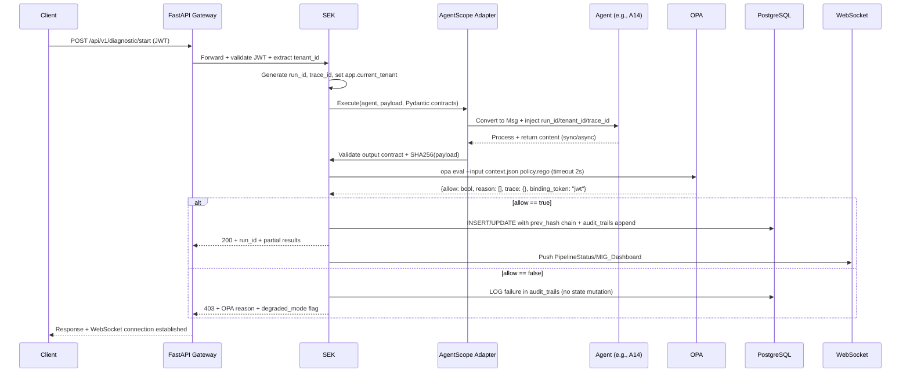

Fabio, segue o `README.md` **completo e atualizado**, com os 3 blocos técnicos inseridos nos pontos estratégicos, mantendo 100% do conteúdo original e sem adicionar funcionalidades novas.

Pronto para copiar e colar diretamente no repositório.

---

# Fellow Governance 🛡️🤖
> SaaS Platform for AI Governance, Geometric Interpretability, and Adversarial Defense  
> *Translating technical requirements into auditable legal evidence and executable policies*

[](LICENSE)
[](https://python.org)
[](https://fastapi.tiangolo.com)
[](https://nextjs.org)
[](https://openpolicyagent.org)

---

## 🎯 Mission

Empower **AI governance leaders** and **legal professionals** to respond to AI framework violation notices (NIST AI RMF, EU AI Act, PL 2338/2023, LGPD), transforming complex technical requirements into:

- ✅ Auditable legal evidence
- ✅ Executable Rego policies via OPA
- ✅ Immutable audit trails (SHA-256 hash chain)
- ✅ Adversarial defense generation in ≤300 seconds

### 👥 Target Audience
| Profile | Primary Use Case |
|--------|----------------------|
| ⚖️ Lawyer | Defense Mode: upload violation notice → 3-line thesis + forensic ZIP |
| 🛡️ AI Governance Lead | Risk dashboard, OPA deployment blocking, MSB-21 tracking |
| 📋 Auditor | Immutable trails, forensic reports, evidence linked to controls |
| 💻 Security/DevOps | Rego bundle deployment, drift monitoring, CI/CD integration |

---

## ⚡ The Problem We Solve

❌ **WITHOUT Fellow Governance**: CEO pushes for speed → Model goes live without AIBOM, provenance, or drift monitoring → ANPD fine (R$2M+) → Governance team fired → Cycle repeats.

✅ **WITH Fellow Governance**: OPA gatekeeper blocks deployment if MSB-21 fails → Immutable audit trail records bypass attempts → AI Governance presents scores, gaps, and policies → CEO aligns with real risk → Compliance implemented **before** the violation notice.

---

## 🏗️ System Architecture (Complete View)
```
┌─────────────────────────────────────────────────────────────┐
│                     FELLOW GOVERNANCE                        │
│  ┌─────────────────────────────────────────────────────────┐│
│  │                    FRONTEND (Next.js 14)                ││
│  │  Chat • PolicyViewer • EvidenceGraph • DefenseResults  ││
│  └───────────────────────────┬─────────────────────────────┘│
│                              │ HTTPS / WebSocket            │
│  ┌───────────────────────────▼─────────────────────────────┐│
│  │                    BACKEND (FastAPI)                    ││
│  │  ┌─────────────────────────────────────────────────┐    ││
│  │  │         SYSTEM EXECUTION KERNEL (SEK)          │    ││
│  │  │  EventBus → Scheduler → StateEngine → PolicyGate│   ││
│  │  │  ↕ MIG Orchestrator ↕ PBSAI Controller ↕ Def   │    ││
│  │  └─────────────────────────────────────────────────┘    ││
│  │  22 AGENTS (A01–A18 + D01–D04)                         ││
│  └───────────────────────────┬─────────────────────────────┘│
│                              │                               │
│  ┌───────────────────────────▼─────────────────────────────┐│
│  │         INFRA: PostgreSQL+pgvector │ Redis │ OPA       ││
│  └─────────────────────────────────────────────────────────┘│
└─────────────────────────────────────────────────────────────┘
```

### 🔑 Critical Components

| Component | Purpose | Technology |
|------------|-----------|------------|
| **SEK** | Deterministic agent orchestration | Python + agentscope |
| ** MIG** | Intrinsic interpretability (relevance vectors) | pgvector + transformers |
| **PBSAI** | Security by design (21 MSB-21 controls) | Rego + evidence graph |
| **PCG** | Contr ol plane: admissibility → validation → execution | State machine + OPA |
| **AEC** | Controlled execution architecture (runtime governance) | Hash chain + audit trails |
| **Defens e Orchestrator** | Adversarial response in ≤300s | Timer + per-tenant semaphore |

---

## 🔄 End-to-End Request Lifecycle
*(Inserted: Explicit step-by-step flow showing identity propagation, enforcement, and persistence)*



**Identity & Context Propagation**:
- `tenant_id` → Injected at Gateway → Enforced via PostgreSQL RLS → Scoped in all `audit_trails` and `defense_runs`.
- `run_id` → Generated by SEK → Immutable across all adapters, agents, and OPA evaluations.
- `trace_id` → W3C `traceparent` header → Propagated to OpenTelemetry, logs, and WebSocket frames.

---

## 🤖 The 22 Specialized Agents (Complete I/O Matrix)

| Agent | Name | Input | Output | For mat |
|--------|------|---------|-------|---------|
| A01 | Legislative Monitor | Law text, bill summary | Legislative changes + impact | JSON |
| A02 | Impact Simulator | Model +  regulatory scenario | Fiscal/legal risk score | JSON |
| A03 | Data Validator | CSV/JSON dataset | Quality report + gaps | JSON |
| A04 | Intelligence Demands | NL query | Evidence  collection plan | JSON |
| A05 | Risk Engine | Features + context | Risk matrix (prob × impact) | JSON |
| A06 | Framework Reconciler | NIST, EU AI Act, PL 2338 | Cross-mapped con trols | JSON |
| A07 | AI Governance Classifier | Model metadata | Maturity level (1-5) | JSON |
| A08 | MIG Auditor | Model layer vectors | Interpretability report | JSON |
| A09  | Output Generator | Partial results | Consolidated report + NL | JSON + Markdown |
| A10 | Structural Auditor | Code/Model | Best practices checklist | JSON |
| A11 | External Kno wledge Integrator | Query + sources | Enriched context | JSON |
| A12 | OPA Gatekeeper | Proposed action + context | allow/deny + reason | Rego decision |
| A13 | Universal Integra tor | PDF, CSV, API, DB | Normalized structured data | JSON |
| **A14** | **Active Hunter** | **Legal/regulatory topic** | **Precedents from user-configured sources** | **JSON** |
 | A15 | Insight Curator | Evidence + context | Actionable recommendations | JSON |
| A16 | Shadow AI Detector | Network/app logs | Ungoverned model inventory | JSON |
| A17 | Polic y-as-Code YAML Generator | Selected controls | Structured YAML for OPA | YAML |
| A18 | Rego Compiler | YAML + templates | Compiled .rego bundle | Rego |
| D01 | Adversarial Analyz er | Violation notice + docs | Extracted entities + initial thesis | JSON |
| D02 | MSB-21 Gap Finder | Evidence + baseline | Gap list with confidence | JSON |
| D03 | MIG Evidence  Generator | Relevance vectors | Graph + NL explanation | JSON + SVG |
| D04 | Regressive Rego Generator | Detected gap + context | Authority-limiting policy | Rego |

 > All agents follow Pydantic contracts for input/output, ensuring type safety, validation, and complete traceability.

---

### 🔌 A14 - Active Hunter (User-Configurable Integratio ns)

Agent **A14** has no fixed pre-connected APIs. Instead, the user configures their own sources for precedents and case law:

| Source Type | Examples | Configuration Format |
| ---------------|----------|------------------------|
| REST APIs | STJ, ANPD, TJSP, Official Gazette | URL + API Key + endpoint pattern |
| Webhooks | Internal legal systems | Call back endpoint + webhook secret |
| RSS/Atom | Official gazettes, bulletins | Feed URL + polling interval (min 1h) |
| Files | PDFs, downloaded HTML | S3/GCS bucket + schedule |
| L LM Extractor | Free-text precedents | Customizable prompt + schema validation |

**Operational Flow:**
1. User registers source via UI or API (`POST /api/v1/sources`)
2. System tes ts connectivity (health check)
3. A14 collects data according to schedule (or on-demand)
4. If source fails → fallback: last collected data + `stale_data=true` flag
5. Rate limits  respect user configuration (default: 10 req/min)

---

## 🔬 MIG: Geometric Interpretability Engine
*(Proprietary implementation based on QILIS/QIXAI – Willis, 2026)*

 > 📝 **Standardization Note**:  
 > • **MIG** = Geometric Interpretability Engine (Fellow Governance commercial name)  
 > • **QILIS** = Academic framework by John M. Willis that inspires the implementation  
 > • **PCG** = Governance Control Plane (commercial name)  
 > • **AGCP** = AI Governance Control Plane (reference academic framework)  
 > *We use public mathematics (vector spaces, hash chains) and cite academic inspiration, without distributing third-party software.*

### What It Does
Instead of generic textual ex planations ( "the AI decided X because Y "), MIG uses **Hilbert Space mathematics** and **Relevance Vectors** to geometrically prove which neurons/parameters influenced a decision.

### How It Works in Practice
1. **AMSE* * (Adaptive Model State Extraction): Extracts relevance vectors (**tenant-configurable dimensionality: 256/512/768/1024**) per AI layer. If the original model has higher dimensiona lity than configured, applies PCA for reduction.
2. **RBCO** (Relevance-Based Confidence Oracle): Calculates adaptive confidence based on vector relevance.
3. **KB** (Knowledge Bas e): Stores vectors in pgvector with **90-day TTL** (default for auditable evidence). Temporary sessions may use reduced TTL (24h) with explicit flag.
4. **IOG** (Interpretability O utput Generator): Generates outputs by profile (dev, auditor, lawyer) with heatmaps, graphs, and natural language explanations.

### Legal Use Case Example
 > **Accusation**:  "The AI denied credit due to racial bias. "  
 > **MIG Response**:  "Relevance vectors show the decision was influenced by 'payment history' (weight 0.92) and 'verified income' (weight 0.88). Protected variables ('ZIP code', 'race') had relevance  <0.03. Hilbert Space projection graph attached. "

### Intellectual Property Status
✅ You use **public mathematics** (vector spaces, cosine similarity)  
✅ Cite inspiration: * "Analysis based on geometric relevance metrics inspired by lifecycle transparency standards (Willis, 2026) "*  
❌ Does not distribute third-party proprietary software

---

## ⚖️ PCG: Governance Control Plane
*(Proprietary implementation based on AGCP – Willis, 2026)*

 > 📝 **Standardization Note**: See MIG section above for commercial vs. academic nomenclature.

### What It Does
It's the  "deterministic brain " that sits between AI and the real world. No AI action is executed without passing through 3 stages:
1️⃣ ADMISSIBILITY → Is the proposed action legal? (check against PL 2338, LGPD, etc.)
2️⃣ BINDING VALIDATION → Does authority for this action exist at execution time?
3️⃣ EXECUTION → Only after 1 and 2, the action becomes real
### How It Works in Practice
- Lawyer uploads PL 2338 → PCG translates articles into Rego rules.
- Client's AI tries to trigger high-risk automated decision → PCG consults OPA.
- If rule violated → PCG halts execution and records in audit trail.

### Detailed PCG Workflows

#### 1. Canonical State Qualification
Input: RawState{freshness, completeness, provenance, confidence}
Rules:
• freshness < 24h → PASS else FAIL
• completeness == all_required_fields → PASS else FAIL
• provenance verified via hash chain → PASS else FAIL
• confidence ≥ 0.85 → PASS else FLAG_FOR_REVIEW
Output: CanonicalState{qualified: bool, reasons: [], timestamp}
#### 2. Admissible Set Adjudication
Input: CandidateTransitions[] (multiple possibilities)
Process:
Scheduler generates N candidate transitions
Re-derives authority at commit (re-check OPA)
Resolves conflicts via majority vote + timestamp tie-breaker
Applies binding validation: policy + context → allow/deny
Output: AdmissibleTransition{selected_id, binding_proof, audit_entry}
#### 3. Binding Validation (OPA + Context)
Input: Policy(Rego) + Context{user, role, resource, action}
OPA Evaluation:
• opa eval --input context.json policy.rego
• Timeout: 2s (global invariant)
• Result: {allow: bool, trace: [], token: jwt}
Output: BindingDecision{allow, token, trace_id, expires_at}
---

## 🔄 AEC: Controlled Execution Architecture
*(Based on RGA – Willis, 2026)*

### What It Does
Ensures governance happens **while the system runs**, not after the error has occurred.

### How It Works in Practice
- Each AI "proposal" is recorded as `proposal_hash`.
- Each PCG "validation" generates `validation_hash`.
- Both are chained in `audit_trails` via SHA-256 (append-only).
- Result: **Forensic ZIP** with technical proof that governance was active at the millisecond of decision.

### Hash Chain Recovery Procedure

When the `DATA_LINEAGE` invariant detects a hash chain break:

| Phase | Action |
|------|----------|
| **LOCK_SESSION** | Blocks NEW writes (INSERT/UPDATE/DELETE). Allows reads and audit operations. |
| **Notification** | P0 alert sent to tenant Slack/Email + system admin. |
| **Recovery** | Operator with `auditor_supervisor` role issues a `recovery_token` (offline-signed JWT, expires in 1h). |
| **New chain** | `prev_hash = SHA256("RECOVERY_AFTER_BREAK_" + timestamp + recovery_token)` |
| **Registration** | Recovery event recorded in separate `recovery_events` table (unmodifiable). |
| **Validation** | System verifies new chain integrity before releasing writes. |

### Forensic ZIP Structure
forensic_YYYY-MM-DD-XXX.zip
├── manifest.json          (run_id, tenant_id, timestamp)
├── diagnosis.json         (analysis results)
├── policies/              (policy_v1.rego, policy_v1.yaml)
├── mig_relevance_summary.json
├── pbsai_control_sheet.json
├── audit_chain.json       (SHA-256 chained, append-only)
└── signature.sha256       (GPG-signed)
---

## 🛡️ PBSAI: Security by Design
*(21 MSB-21 Controls + 12 Governance Domains)*

### MSB-21: Minimum Security Baseline (21 controls)
| # | Control | Description |
|---|----------|-----------|
| 1 | Model Inventory | Centralized catalog of all production models |
| 2 | Signed AIBOM | AI Bill of Materials with hash and digital signature |
| 3 | Hermetic builds + pinned deps | Reproducible builds with locked dependencies |
| 4 | Dataset Provenance | Complete traceability of training data origin |
| 5 | Drift monitoring (MIG) | Continuous deviation monitoring via relevance vectors |
| 6 | Human-in-the-loop for high-risk | Mandatory human review for high-impact decisions |
| 7 | Structured decision logging | Machine-readable logs with full context |
| 8 | Evidence retention policy | Configurable TTL for audit trails (default 90 days) |
| 9 | Pre-deploy bias tests | Automated bias detection suite |
| 10 | Incident response plan | Governance failure playbook |
| 11-21 | *(additional security, privacy, transparency, accountability controls)* |

### 12 Governance Domains
A-GRC    : Governance, Risk, Compliance
B-Ethics : Ethics and Fairness
C-Privacy: Privacy and Data Protection
D-Security: Cybersecurity
E-Data   : Data Quality, Lineage, and Management
F-Model  : Model Development, Validation, and Monitoring
G-Ops    : Operations, Deployment, and Scalability
H-Human  : Human-AI Interaction and Training
I-Legal  : Regulatory and Legal Compliance
J-Supply : Third-party and Supply Chain Risks
K-Transp : Transparency and Explainability
L-Resil  : Resilience, Recovery, and Continuity
### Evidence Graph
- Interactive tree (react-flow/d3) showing attended/violated controls.
- Each node links to `audit_trails` and `kb_state` for deep auditing.

### 🖼️ Mockup: Evidence Graph (react-flow)
```
┌─────────────────────────────────────────────────────────────┐
│  EVIDENCE GRAPH - Fellow Governance                         │
│  Run: def-2026-04-18-001 | Tenant: org_publica_01          │
├─────────────────────────────────────────────────────────────┤
│                                                              │
│  [MSB-21 #2: AIBOM] ──❌── [Gap: Missing]                   │
│         │                                                   │
│         ▼                                                   │
│  [audit_trails] ──── SHA256: a3f2...9c1b                 │
│         │                                                   │
│         ▼                                                   │
│  [kb_state] ──📊── Relevance Vector (512-d)                │
│         │                                                   │
│         ▼                                                   │
│  [IOG Report] ──📄── "Drift < 0.03 on protected variables"│
│                                                              │
│  Legend:                                                  │
│  ✅ Control met  ❌ Gap detected  🔗 Hash chain            │
│  📊 pgvector    📄 NL explanation   ⚠️ Alert              │
│                                                              │
│  [🔍 Zoom] [📥 Export PNG] [🔗 Copy URL]                 │
└─────────────────────────────────────────────────────────────┘
```
> 💡 **In interactive HTML**: This mockup will be replaced by a real `react-flow` component, with clickable nodes that expand to `audit_trails`, `kb_state`, and natural language explanations.

---

## ⚡ Adversarial Defense Pipeline (≤300 seconds)
1️⃣ UPLOAD (0-10s)
• Lawyer uploads: violation notice, model report, training CSV
• System validates format, extracts metadata, generates run_id
2️⃣ PARALLEL ANALYSIS (10-180s)
• D01: Extracts entities, maps applicable framework
• D02: Compares evidence vs MSB-21 → gap list with confidence
• D03: MIG generates relevance vectors + geometric explanation
• D04: Compiles regressive policy limiting agent authority
3️⃣ COMPILATION (180-270s)
• Assembles results into structured JSON
• Generates Forensic ZIP with hash chain + GPG signature
• Compiles Rego bundle for immediate deployment
4️⃣ DELIVERY (270-300s)
• Returns: detected_gaps[], proposed_defense{line1,2,3}, forensic_zip_url, regressive_policy.rego
• WebSocket notifies frontend: DefenseResults
### Timer Isolation Mechanism (DEFENSE_TIMER)

| Mechanism | Specification |
|-----------|---------------|
| **Per-execution timeout** | `asyncio.wait_for(task, timeout=300)` |
|  **Per-tenant concurrency** | Semaphore with max 1 simultaneous execution per tenant |
| **Global concurrency** | Semaphore with max 5 simultaneous executions (prevents worker exhau stion) |
| **Timeout fallback** | Returns `degraded_response` + flags `timeout_occurred=true` + audit logs |
| **Metric** | `defense_pipeline_duration_seconds{tenant,status}` in Pr ometheus |

### Defense Output Example
```json
{
   "run_id ":  "def-2026-04-18-001 ",
   "execution_time_ms ": 287000,
   "detected_gaps ": [
    { "control_id ":  "MSB-21 #2 ",  "description ":  "Missing signed AIBOM ",  "confidence ": 0.94},
    { "control_id ":  "MSB-21 #7 ",  "description ":  "Logs without full context ",  "confidence ": 0.88}
  ],
   "proposed_defense ": {
     "line1 ":  "Missing minimum artifacts (AIBOM, provenance) prevents willful misconduct imputation. ",
     "line2 ":  "Lack of hermetic builds and drift monitoring constitutes accuser's governance failure. ",
     "line3 ":  "MIG proves no causality between protected variables and decision (drift  < 0.03). "
  },
   "forensic_zip ":  "https://api.fellowgovernance.com/forensic/def-2026-04-18-001.zip ",
   "regressive_policy ":  "package ceis.regressive\ndefault allow = false\nallow { input.review_by_human == true } "
}
```

🔧 **Adapter Compatibility & Canonical Execution Contract**
This block defines the formal interoperability rules between all system layers. It establishes the canonical execution contract, ensuring semantic consistency across versions, agents, and distributed components.
🧭 **1. Immutable Contract Principle**
Every system layer operates under the principle that:
• Contract structures are immutable across versions
• Only internal implementations may evolve
• Public interfaces are versioned, not reinterpreted
• No component may alter another component's semantics without explicit version extension.
🔗 **2. Layers Covered by the Contract**
This contract applies in full to:
• SEK (System Execution Kernel)
• AgentScope (agent runtime)
• OPA (Policy Engine)
• PCG / StateEngine (State Governance)
• MIG / QILIS (Vector Interpretability)
• EventBus (Event System)
• Frontend Contracts (API + WebSocket)
• Agents A01–A18 and D01–D04
📦 **3. Structural Compatibility (Adapter Rules)**
A component is considered compatible if:
**3.1 Input/Output Interface**
• Maintains compatible Pydantic schema
• Does not remove existing required fields
• Does not change types without explicit versioning
**3.2 Execution Identity**
• `run_id` is globally immutable
• `tenant_id` is mandatory for every operation
• `trace_id` must be propagated without modification
**3.3 Events (EventBus)**
• `event_type` is extensible, not modifiable
• `payload` may evolve only by version
• `metadata.correlation_id` must be preserved end-to-end
**3.4 OPA Decisions**
• Fixed structure:
```json
{
  "allow": boolean,
  "reason": string[],
  "trace": object,
  "binding_token": string
}
```
• No version may alter this base contract
**3.5 Audit Trail**
• Mandatory append-only structure
• `prev_hash` chained via SHA-256
• Any break invalidates the `run_id`
🔄 **4. Semantic Versioning Rules**
The system adopts independent versioning per layer:
| Layer | Rule |
| ---|---|
| Agents | MAJOR = contract change / MINOR = logic / PATCH = bugfix |
| Policies (OPA) | Always versioned via bundle ( `bundle_version` ) |
| MIG/QILIS | Mandatory vector schema versioning |
| API | `/v1`, `/v2` with explicit backward compatibility |
| EventBus | Additive evolution only (append-only schema) |

🧠 **5. No-Semantic-Reinterpretation Rule**
No layer may reinterpret another layer's responsibility:
• SEK does not redefine OPA rules
• OPA does not redefine StateEngine
• MIG does not redefine policy decisions
• Frontend does not alter execution contracts
• Agents do not modify system invariants
Each layer may consume another layer, but never redefine its semantics.
⚙️ **6. Adapter Layer (Cross-Version Compatibility)**
When version divergence occurs:
• Compatibility is resolved via an explicit Adapter Layer
• Never via direct contract modification
Adapters must:
• Translate schema
• Preserve original semantics
• Record transformation in `audit_trails`
Example:
`Agent v1 → Adapter → Agent v2` (no contract break)
🔒 **7. Global Compatibility Invariants**
These invariants are mandatory across all versions:
| Invariant | Description |
| ---|---|
| 🔒 NO_RUN_REPROCESS | No `run_id` may be reprocessed with altered logic |
| 🔗 NO_TRAIL_REWRITE | No `audit_trail` may be rewritten |
| ✅ NO_OPA_REINTERPRET | No OPA decision may be reinterpreted after commit |
| 📡 NO_EVENT_REMOVAL | No event may be removed from EventBus |
| ⏱️ NO_HISTORY_MUTATION | No execution may alter previous history |
📌 **8. Final Rule (System Stability Clause)**
The system evolves by contract extension, never by retroactive meaning modification.
Every evolution must obey:
• Mandatory backward compatibility
• Explicit versioning of semantic change
• Complete auditability preservation

📋 **Operations & Runbooks**
1. **Secrets Management**
   - Tool: AWS Secrets Manager or HashiCorp Vault
   - Rotation: Automatic every 90 days
   - Scope: `DATABASE_URL`, `OPA_URL`, `JWT_SECRET`, `GPG_KEYS`
2. **Backup & Recovery (with pgvector)**
   | Metric | Value | Implementation |
   | ---|---|---|
   | RPO | 1h | Incremental backup via WAL archiving |
   | RTO | 4h | Automated restore + health check |
   | Retention | 30 daily + 12 monthly | S3 lifecycle policy |
   | pgvector specific | `pg_dump --binary-upgrade` | Preserves HNSW/IVFFLAT indexes |
   | Post-restore validation | Similarity search smoke test (k=5) | Verifies embedding integrity |
3. **Critical Alerts (SLOs)**
   | Condition | Severity | Automatic Action |
   | ---|---|---|
   | OPA timeout  >2s | P1 | Fallback to policy cache (degraded mode) |
   | OPA offline  >5s | P0 | BLOCKS all writes, read-only mode |
   | Hash chain break | P0 | LOCK_SESSION + security notification |
   | Defense pipeline  >300s | P1 | Timeout + degraded response + audit log |
   | CPU/Mem  >90% per tenant | P2 | Throttling + capacity alert |
4. **OPA Fallback (Operation Modes)**
   | Mode | Condition | Behavior |
   | ---|---|---|
   | Normal | OPA responds in  <2s | Full validation with JWT token |
   | Degraded | OPA timeout 2s–5s | Uses last valid decision cache + marks `degraded_mode=true` in audit trail |
   | Read-only | OPA timeout  >5s or offline | BLOCKS all writes, returns `503` for mutations, allows reads |
   | Recovery | Health check every 30s | Returns to Normal mode when OPA responds |
5. **Rate Limiting by Endpoint (Anti-DoS Protection)**
   | Endpoint | Limit per tenant | Window | Response Headers |
   | ---|---|---|---|
   | POST /api/v1/diagnostic/start | 10 | 1 minute | `X-RateLimit-Limit`, `X-RateLimit-Remaining`, `X-RateLimit-Reset` |
   | POST /api/v1/defense/start | 3 | 1 minute | (same headers) |
   | POST /api/v1/opa/eval | 100 | 1 minute | (same headers) |
   | POST /api/v1/policies/compile | 20 | 1 hour | (same headers) |
   | GET /api/v1/audit/{run_id} | 200 | 1 minute | (same headers) |
   Exceeding the limit returns HTTP 429 (Too Many Requests) with body `{"error": "rate_limit_exceeded", "retry_after": seconds}`
6. **WebSocket: Reconnection & Persistence**
   | Feature | Specification |
   | ---|---|
   | Automatic reconnection | Exponential backoff: 1s, 2s, 4s, 8s, 16s, max 30s |
   | Last Message ID | Client sends `{ "last_seq ": 123}` on reconnection |
   | Message buffer | Server maintains 5-minute buffer (configurable) |
   | Replay | Server replays messages from `last_seq` |
   | Heartbeat | Ping/Pong every 30s (60s timeout) |
7. **Compliance Matrix (MSB-21 → Feature → Evidence)**
   | Control | Feature | Auditable Evidence |
   | ---|---|---|
   | #1 Inventory | A07 + Dashboard | `agent_runs` + `documents` |
   | #2 Signed AIBOM | A10 + A18 | `audit_trails` + `signature.sha256` |
   | #3 Hermetic builds | CI/CD + A18 | GitHub Actions logs + `policy.sha256` |
   | #4 Dataset Provenance | A13 + A03 | `documents.hash_sha256` + `kb_state` |
   | #5 Drift monitoring | MIG/AMSE | `kb_state.relevance_vector` + IOG report |
   | #6 Human-in-the-loop | PCG + A12 | `opa_decisions.binding_token` + `users.role` |
   | #7 Structured logging | SEK + A09 | `audit_trails` append-only |
   | ... | ... | ... |
   ✅ All evidence is extractable via API `/api/v1/audit/{run_id}` or Forensic ZIP.

8. **Distributed Error Handling & Compensation** *(Inserted)*
   - **External Integrations (A14)**: Exponential backoff (2s → 4s → 8s → max 30s) with circuit breaker. After 3 consecutive failures, marks `health_status=degraded`, returns `stale_data=true`, and logs to `audit_trails`. No pipeline abort; continues with cached context.
   - **Idempotency (`defense_runs`)**: `run_id` acts as idempotency key. Duplicate `POST /defense/start` within TTL returns cached result or in-progress status. Status transitions are strictly monotonic (`pending → analyzing → compiling → delivered/timeout`).
   - **Compensation Logic**: If an agent succeeds but OPA rejects or hash chain breaks mid-pipeline, system **never** deletes or rewrites existing `audit_trails` (invariant `NO_TRAIL_REWRITE`). Instead, it appends a `compensation_event` with `status=compensated`, `reason="opa_deny|timeout|chain_break"`, and triggers `degraded_response`. State is marked inconsistent but fully auditable.

🛠️ **Complete Technology Stack**
- **Backend**: Python 3.11 + FastAPI 0.104+, agentscope 0.5+, PostgreSQL 14 + pgvector, Redis 7, OPA 0.58, Celery 5.3, Pydantic 2.0, spaCy 3.7 + sentence-transformers 2.2, python-gnupg 0.5, Alembic 1.12, structlog + Prometheus + OpenTelemetry
- **Frontend**: Next.js 14 (App Router) + React 18 + TypeScript 5, Tailwind CSS 3.3 + Zustand 4.4, React Query 5.0 + Chart.js 4.4, react-flow 11.8 + socket.io-client 4.5
- **Infrastructure**: Docker 24+ + Kubernetes 1.27 + Helm 3.12, GitHub Actions + Terraform 1.5, Prometheus 2.45 + Grafana 10.0 + Loki 2.9, AWS/GCP ready

🗄️ **Database Schema (16 Tables)**
- `tenants` (1)──N users, documents, agent_runs
- `agent_runs` (1)──N policies, opa_decisions
- `audit_trails`: prev_hash chained (SHA-256, append-only)
- `kb_state`: pgvector relevance vectors (configurable dimensions), 90d TTL
- `defense_runs`: independent, linked to tenants & audit_trails
- `sources`: external integration configurations (A14)
- `recovery_events`: hash chain break and recovery log

Main tables:
• `tenants`: id, name, plan, status, mig_dimension (256/512/768/1024)
• `users`: id, tenant_id, role, email, password_hash
• `documents`: id, tenant_id, hash_sha256, mime_type, uploaded_at
• `agent_runs`: id, run_id, agent_name, status, input_hash, output_hash
• `policies`: id, run_id, rego_text, sha256, deployed_at, bundle_version
• `opa_decisions`: id, policy_id, result, binding_token, trace, degraded_mode
• `audit_trails`: id, run_id, prev_hash, payload_hash, timestamp
• `kb_state`: id, layer_id, relevance_vector (pgvector), ttl_expires (default 90d)
• `msb21_attest`: id, artifact_id, signature, baseline_status
• `pbsai_evid_graph`: id, node_type, edge_type, trace_id
• `defense_runs`: id, run_id, case_text, gaps_json, rego_policy, elapsed_ms, timeout_occurred
• `websocket_sessions`: id, tenant_id, run_id, connected_at, last_seq
• `feature_flags`: id, tenant_id, flag_key, enabled, updated_at
• `sources`: id, tenant_id, source_type, config_json, health_status, last_collected_at
• `recovery_events`: id, tenant_id, previous_prev_hash, new_prev_hash, recovery_token, operator_id
• `adapters`: id, from_version, to_version, transformation_logic_hash, audit_ref
Hash chain in `audit_trails`: `prev_hash = SHA256(previous.payload_hash + previous.timestamp)`
Chain break → system enters LOCK_SESSION → recovery via `recovery_events`

## 🔐 Multi-Tenancy & Data Isolation *(Inserted)*
- **Strategy**: Row-Level Security (RLS) + `tenant_id` scoping across all tables.
- **Enforcement**: FastAPI middleware extracts `tenant_id` from JWT → `SET LOCAL app.current_tenant = '<uuid>'` → PostgreSQL RLS policies filter automatically.
- **Policy Example**:
  ```sql
  CREATE POLICY tenant_isolation ON audit_trails
    USING (tenant_id = current_setting('app.current_tenant')::uuid);
  ALTER TABLE audit_trails ENABLE ROW LEVEL SECURITY;
  ```
- **Cross-Tenant Prevention**: No `JOIN` or subquery allowed without explicit `tenant_id` filter. SEK validates isolation before dispatching agents. Audit logs include `tenant_id` for forensics.

🔐 **6 Global Invariants (Mandatory Rules)**
| Invariant | Description | Implementation |
| ---|---|---|
| 🔒 RESOURCE_CAP | CPU/memory budget per tenant to prevent DoS | `if tenant_usage > quota: DENY + alert` |
| 🔗 CODE_IDENTITY | Policy/agent hash unchanged post-deploy for integrity | `if sha256(policy) != deployed_hash: LOCK` |
| 🧵 DATA_LINEAGE | Continuous SHA-256 chain; break → LOCK_SESSION + recovery | `if prev_hash != compute_hash(prev): LOCK_SESSION` |
| ✅ OPA_FINALITY | No DB transition without `allow==true` + OPA commit token (or explicit degraded mode) | `if (!opa_allow && !degraded_mode) || !commit_token: ROLLBACK` |
| 🤖 AI_NO_MUTATION | LLM proposes, only Kernel executes writes (separation of concerns) | `if agent_type == "LLM" && action == "write": DENY` |
| ⏱️ DEFENSE_TIMER | Defense pipeline ≤ 300s + per-tenant isolation | `asyncio.wait_for(task, 300)` + per-tenant semaphore (max 1) |
| 🔒 NO_RUN_REPROCESS | No run_id reprocessed with altered logic | `if run_id exists AND logic_version_changed: DENY` |
| 🔗 NO_TRAIL_REWRITE | No audit trail rewriting | `if operation == "UPDATE" AND table == "audit_trails": DENY` |
| ✅ NO_OPA_REINTERPRET | No OPA decision reinterpretation after commit | `if decision.committed AND new_evaluation != decision: ALERT` |

🔌 **API Endpoints + WebSocket**
**REST API (FastAPI)**
```
POST /api/v1/diagnostic/start     → Start risk analysis (returns run_id)
GET  /api/v1/diagnostic/{run_id}  → Analysis status + partial results
POST /api/v1/defense/start        → Start defense mode (≤300s)
GET  /api/v1/defense/{run_id}     → Defense results + ZIP links
POST /api/v1/policies/compile     → Compile YAML → Rego bundle
GET  /api/v1/policies/{bundle_id} → Download .rego bundle
POST /api/v1/opa/eval             → Evaluate context against policy (OPA proxy)
GET  /api/v1/audit/{run_id}       → Audit trail in JSON format

# Source configuration (A14)
POST /api/v1/sources              → Register new precedent source
GET  /api/v1/sources              → List configured sources
PUT  /api/v1/sources/{id}         → Update configuration
DELETE /api/v1/sources/{id}       → Remove source
POST /api/v1/sources/{id}/test    → Test source connectivity

# Adapter management
GET  /api/v1/adapters             → List available adapters
POST /api/v1/adapters/translate   → Translate payload between versions
```
**WebSocket**
```
/ws/pipeline/{run_id}
→ Messages: PipelineStatus, MIG_Dashboard, DefenseResults, ErrorAlert
→ Authentication: JWT + OPA binding_token
→ Reconnection: Client sends {last_seq: 123}
```

**Main Frontend Components**
• `PipelineStatus`: Real-time progress bar
• `PolicyViewer`: Rego editor with syntax highlighting + diff
• `EvidenceGraph`: Interactive evidence tree (react-flow)
• `KB_Inspector`: Semantic search in relevance vectors
• `MIG_Dashboard`: Drift heatmaps + NL explanations
• `DefenseResults`: 3-line thesis + forensic ZIP download
• `SourcesManager`: UI for configuring external integrations (A14)
• `AdapterManager`: UI for cross-version compatibility rules

📦 **Generated Outputs (Real Formats)**
**Diagnostic (JSON)**
```json
{
   "agent ": "A01",
   "output ": {
     "legislative_changes ": [
      { "article ": "PL 2338/2023 Art. 27-A", "impact ": 0.87, "summary ": "Requires human review for high-risk decisions"}
    ]
  },
   "mig_relevance_vector ": [0.92, 0.78, 0.88, 0.65, "... (configurable dims)"]
}
```
**Rego Policy (Example)**
```rego
package ceis.policy
default allow = false

allow {
  input.risk_score.fiscal < 0.7
  input.risk_score.legal < 0.7
  input.document_has_aibom == true
  input.mig_drift < 0.15
}

deny_reason["MSB-21 #2 violation"] { not input.document_has_aibom }
deny_reason["Excessive drift"] { input.mig_drift >= 0.15 }
```
**Forensic ZIP (Structure)**
```
forensic_2026-04-18-001.zip
├── manifest.json              {run_id, tenant_id, timestamp}
├── diagnosis.json             (complete analysis results)
├── policies/
│   ├── policy_v1.rego         (compiled bundle)
│   └── policy_v1.yaml         (human-readable source)
├── mig_relevance_summary.json
├── pbsai_control_sheet.json   (21 controls status)
├── audit_chain.json           (SHA-256 chained, append-only)
└── signature.sha256           (GPG-signed for verification)
```

📅 **Build Schedule (90 Days | ~250h)**
**Weekly View (12 Weeks)**
| Week | Days | Theme | Main Deliverables |
| ---|---|---|---|
| 1 | 1-7 | Foundation | Docker, Git, FastAPI setup, Next.js scaffold |
| 2 | 8-14 | Database + Auth | PostgreSQL+pgvector, JWT+RBAC, migrations |
| 3 | 15-21 | agentscope + SEK | BaseAgent, EventBus, Scheduler, StateEngine, PolicyGate |
| 4 | 22-28 | Agents A01-A03 | Legislative Monitor, Impact Simulator, Data Validator |
| 5 | 29-35 | Agents A04-A08 | Intelligence Demands, Risk Engine, Framework Reconciler, Gov Classifier, MIG Auditor |
| 6 | 36-42 | Agents A09-A14 | Output Generator, Structural Auditor, External Knowledge Integrator, OPA Gatekeeper, Universal Integrator, Active Hunter (A14) |
| 7 | 43-49 | A15-A18 + MIG | Insight Curator, Shadow AI Detector, Policy-as-Code YAML, Rego Compiler + AMSE/RBCO/KB/IOG |
| 8 | 50-56 | PBSAI | MSB-21 validator (21 controls), 12 domains, evidence graph |
| 9 | 57-63 | PCG + SEK | Vocabulary enforcement, canonical_state, admissible_set, FVL |
| 10 | 64-71 | Defense D01-D04 | Adversarial Analyzer, Gap Finder, MIG Evidence, Regressive Rego + 300s timer + per-tenant semaphore |
| 11 | 72-82 | Frontend | ChatInterface, PolicyViewer, EvidenceGraph, KB_Inspector, MIG_Dashboard, DefenseInterface, SourcesManager, AdapterManager |
| 12 | 83-90 | Testing + CI/CD + Docs | pytest, Playwright, GitHub Actions, Helm charts, complete documentation |

**Day-by-Day Breakdown (Operational Summary)**
- Day 1-7: Infra setup + Git + FastAPI + Next.js
- Day 8-14: Database + JWT authentication + RBAC
- Day 15-21: SEK core (EventBus, Scheduler, StateEngine, PolicyGate)
- Day 22-42: Implementation of 18 analysis agents (A01-A18)
- Day 43-49: Complete MIG (AMSE, RBCO, KB, IOG) + agents A15-A18
- Day 50-56: PBSAI (MSB-21 + 12 domains + evidence graph)
- Day 57-63: PCG workflows (canonical_state, admissible_set, binding_validation)
- Day 64-71: Adversarial defense (D01-D04) + 300s timer + per-tenant semaphore
- Day 72-82: Full frontend (13 main components)
- Day 83-90: Unit/integration tests, CI/CD, documentation, smoke tests
Each week produces a PR with description, tests, and staging deployment.

🚀 **Getting Started (Development)**
```bash
# 1. Clone and initial setup
git clone https://github.com/FABIOEVERTON/Fellow_Reg.git
cd Fellow_Reg

# 2. Backend
cd backend
python -m venv venv && source venv/bin/activate
pip install poetry && poetry install
cp .env.example .env  # configure DATABASE_URL, REDIS_URL, OPA_URL

# 3. Frontend
cd ../frontend
pnpm install
cp .env.example .env.local

# 4. Infrastructure (Docker)
cd ../infrastructure
docker-compose up -d postgres redis opa

# 5. Run services
# Terminal 1: Backend
cd ../backend && poetry run uvicorn app.main:app --reload

# Terminal 2: Frontend  
cd ../frontend && pnpm dev
# Access: http://localhost:3000
```

🧪 **Testing**
```bash
# Backend
cd backend
pytest tests/unit/ -v
pytest tests/integration/ -v --cov=app

# Frontend
cd frontend
pnpm test          # Jest (unit)
pnpm test:e2e      # Playwright (end-to-end)

# OPA policies
opa test policies/ -v

# Complete pipeline smoke test
./scripts/smoke_test.sh  # Validates upload→analysis→defense→ZIP flow
```

🤝 **Contributing**
1. Fork the project
2. Create a feature branch: `git checkout -b feature/my-feature`
3. Semantic commit: `git commit -m 'feat: add MSB-21 #15 validation'`
4. Push: `git push origin feature/my-feature`
5. Open a Pull Request with: problem description, solution, tests added, impact on 6 invariants

✅ PRs must include: problem, solution, tests, invariants impact, screenshots (if frontend)

📄 **License**
Distributed under the MIT License. See `LICENSE` for more information.

🔗 **Useful Links**
🔗 [agentscope](https://github.com/modelscope/agentscope) – Agent orchestration framework
🔗 [Open Policy Agent](https://github.com/open-policy-agent/opa) – Universal policy engine
🔗 [pgvector](https://github.com/pgvector/pgvector) – Vector similarity in PostgreSQL
🔗 [NIST AI RMF](https://www.nist.gov/itl/ai-risk-management-framework) – AI risk management framework
🔗 [PL 2338/2023](https://www.camara.leg.br/proposicoesWeb/fichadetramitacao?idProposicao=23382023) – Brazilian AI Legal Framework

💡 **Intellectual Property Note**:
Fellow Governance is a proprietary implementation following cutting-edge scientific principles established in the technical literature by John M. Willis (QILIS, AGCP, RGA). We use public mathematics (vector spaces, hash chains, policy-as-code) and cite academic inspiration, without distributing third-party software. Our added value lies in practical application to the Brazilian legal context (PL 2338, ANPD, STJ) and an accessible interface for lawyers and managers.

📌 **Nomenclature Note**:
Fellow Governance uses commercial names (MIG, PCG) for components inspired by academic frameworks (QILIS, AGCP – Willis, 2026). This standardization protects the platform's intellectual property while maintaining transparency about scientific foundations.

🎓 **Recommended Courses & Certifications**
| Name / Topic | Platform | Type | Why it's worth it |
| ---|---|---|---|
| OPA Policy Authoring (Rego) | Styra Academy | Free + certificate | Code-level policy-as-code mastery |
| Responsible AI Principles | Microsoft Learn | Free | Ethical and governance foundation for AI |
| Data Governance | ENAP - Virtual Gov School | Free | Solid governance foundation in public sector |
| LGPD Fundamentals | ENAP - Virtual Gov School | Free | Compliance and government agency pathways |
| AI Governance for Responsible Innovation | edX (Univ. Edinburgh) | Audit free | International AI governance perspective |

Developed by Fabio Everton 🇧🇷 [LinkedIn](https://www.linkedin.com/in/fabio-everton-3b62b1129/) • [GitHub](https://github.com/FABIOEVERTON/Fellow_Reg)  
Hands-on technical learning project, built to demonstrate depth in: distributed systems, AI governance, policy-as-code, and enterprise software engineering.